# What is computer 1 and its Architecture
Computer 1 is very small compared to commercial computers, it has the advantage of being simple enough so we can demonstrate the design process without too many complications. 

Computer 1 is  based on stored-program architecture .In stored program architecture, programs and data are stored in a separate storage unit called memories and are treated the same.

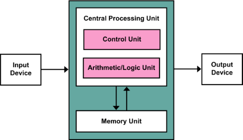

It is also known as **ISA** (Instruction set architecture) computer and is having three basic units:  

1. The Central Processing Unit (CPU) 
1. The Main Memory Unit 
1. The Input/Output Device Let’s consider them in detail.

**1. Central Processing Unit-**

**The central processing unit is defined as the it is an electric circuit used for the executing the instruction of computer program.**

`          `**It has following major components:**

`          `**1.Control Unit(CU)**

`          `**2.Arithmetic and Logic Unit(ALU)**

`          `**3.variety of Registers**

- **Control Unit –** 
  A control unit (CU) handles all processor control signals. It directs all input and output flow, fetches code for instructions, and controls how data moves around the system. 
- **Arithmetic and Logic Unit (ALU) –** 
  The arithmetic logic unit is that part of the CPU that handles all the calculations the CPU may need, e.g. Addition, Subtraction, Comparisons. It performs Logical Operations, Bit Shifting Operations, and Arithmetic operations. 
- **Registers –** Registers refer to high-speed storage areas in the CPU. The data processed by the CPU are fetched from the registers. 
- **Buses –** Data is transmitted from one part of a computer to another, connecting all major internal components to the CPU and memory, by the means of Buses. Types: 
- **Data Bus:** It carries data among the memory unit, the I/O devices, and the processor. 
- **Address Bus:** It carries the address of data (not the actual data) between memory and processor. 
- **Control Bus:** It carries control commands from the CPU (and status signals from other devices) in order to control and coordinate all the activities within the computer**.**

**Input/Output Devices –** Program or data is read into main memory from the *input device* or secondary storage under the control of CPU input instruction. *Output devices* are used to output information from a computer. If some results are evaluated by the computer and it is stored in the computer, then with the help of output devices, we can present them to the user.

The computer 1 consists of the following hardware components: 

1\. A memory unit with 4096 words of 16 bits each 

2\. Nine registers: AR, PC, DR, AC, lR, TR, OUTR, lNPR, and SC 

3\. Seven flip-flops: l, S, E, R, lEN, FGl, and FGO 

4\. Two decoders: a 3 x 8 operation decoder and a 4 x 16 timing decoder 

5\. A 16-bit common bus 

6\. Control logic gates 

7\. Adder and logic circuit connected to the input of AC

List of Registers for Computer 1 :

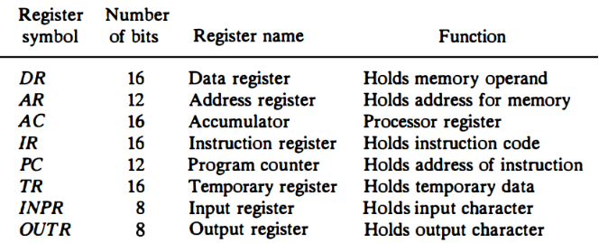
# What is Logisim and why is it used in the implementation of Computer 1
Logisim is a graphical tool used for designing and simulating digital logic circuits. It's primarily utilized in the field of computer science and electrical engineering for educational purposes, prototyping digital systems, and understanding the behaviour of logic circuits.

Here's why Logisim is used in the implementation of computer 1:

1\. Educational Tool: Logisim provides a user-friendly interface that allows students to experiment with digital circuits without the need for physical hardware. It helps them understand fundamental concepts like logic gates, flip-flops, multiplexers, and more.

2\. Prototyping: Before implementing a digital circuit in hardware, it's often beneficial to simulate it first. Logisim allows designers to create and test complex digital systems virtually, ensuring they function as expected before committing to physical implementation.

3\. Debugging: When designing complex digital systems such as computer architectures, debugging can be a daunting task. Logisim's simulation capabilities enable designers to observe the behaviour of circuits step by step, making it easier to identify and rectify errors.

4\. Visualization: Visualizing the behaviour of digital circuits is crucial for understanding their functionality. Logisim provides a graphical representation of circuits, making it easier to comprehend their structure and operation compared to textual descriptions.

5\. Cost-Effective: Building physical prototypes of digital circuits can be expensive and time-consuming. Logisim eliminates the need for costly hardware components, allowing designers to experiment and iterate quickly at minimal cost.

6\. Flexible Design: Logisim supports the design of a wide range of digital circuits, from simple combinational logic to complex sequential logic. This flexibility makes it suitable for implementing various components of a computer, including arithmetic logic units (ALUs), registers, memory units, and control units.

`  `**Instruction  Set  Of  Computer1**  

The  basic  computer  has  a  16-bit  instruction  register  (IR)  which  can  denote  either  memory  reference  or  register reference  or  input-output  instruction.  

**1).Memory  Reference  –** These 	  instructions  refer  to  memory  address  as  an  operand.  The  other  operand  is  always  an  accumulator.  Specifies  12-bit  address,  3-bit  opcode  (other  than  111),  and  1-bit  addressing  mode  for  direct  and  indirect  addressing.  

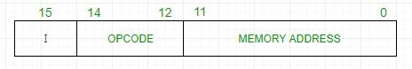** 
**

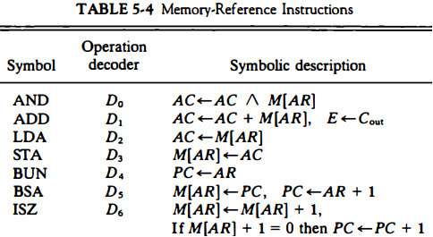
**

**2).Register  Reference  –** These 	  instructions  perform  operations  on  registers  rather  than  memory  addresses.  The  IR(14  –  12)  is  111  (differentiates  it  from  memory  reference)  and  IR(15)  is  0  (differentiates  it  from  input/output  instructions).  The  rest  12  bits  specify  register  operation. 

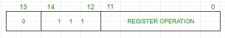

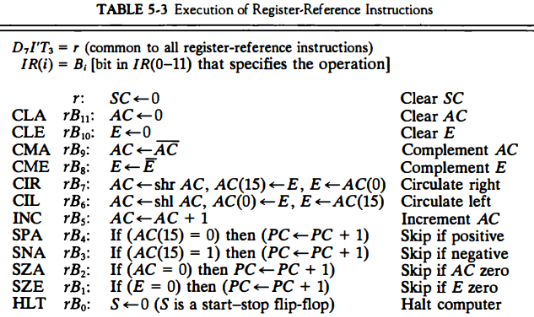

**3).Input/Output  Reference –** These   instructions  are  for  communication  between  the  computer  and  outside  the  environment.  The  IR(14  –  12)  is  111  (differentiates  it  from  memory  reference)  and  IR(15)  is  1  (differentiates  it  from  register  reference  instructions).  The  rest  12  bits  specify  I/O  operation.  

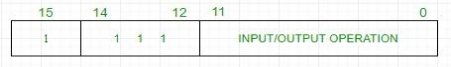

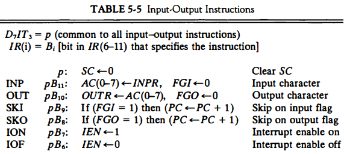

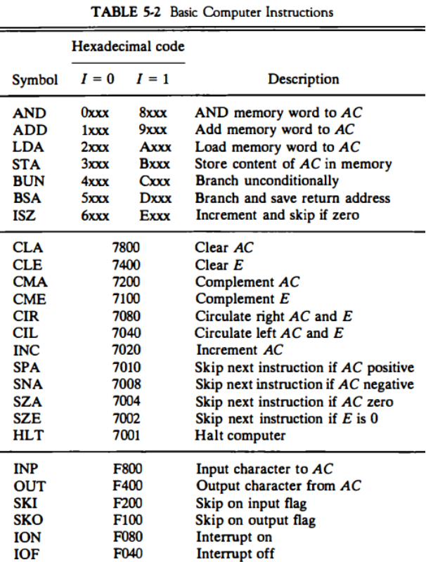

### INSTRUCTION  CYCLE  
1)Instruction  fetching  

2)Instruction  decoding  

3)Effective  address  calculation  

4)Operator  fetching  

5)Instruction  execution  

#### *Instruction  fetching( Memory  to CU):-*  
**  

<b>T 0 :          AR <- PC</b>  	  

<b>T 1 :          AC <- M[AR] , PC <- PC+1</b> 	 	 
**

#### *Instruction  decoding:-*  
<b>T2  :              AC(0-7) <- Decode(IR(12,13,14)) ,</b> 

`                    `**I<-IR(15) , AR<-IR(0-11)** 	    

*Effective  address  calculation* **:-**  

<b>D 7’  IT 3 :           AR <- M[AR]</b> 	  
**

# *Operator  fetching:-*  
<b>D0T4 :                DR <- M[AR]</b> 	  

#### *Instruction  execution:-*  
<b>D0T5 :               AC <- AR^DR , SC<-0</b> 

</b>	
**

**

` `The  Hardwired  Control  organization  involves  the  control  logic  to  be  implemented  with  gates,  flip-flops,  decoders,  and  other  digital  circuits.  

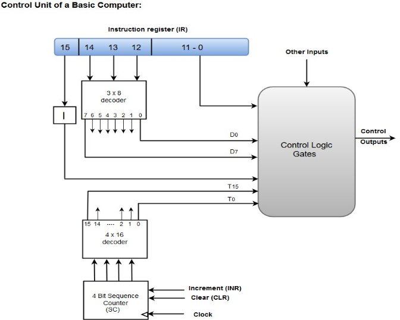  

- A  Hard-wired  Control  consists  of  two  decoders,  a  sequence  counter,  and  a  number  of  logic  gates.  
- An  instruction  fetched  from  the  memory  unit  is  placed  in  the  instruction  register  

  (IR).  

- The  component  of  an  instruction  register  includes;  I  bit,  the  operation  code,  and adress  bits  0  through  11.  
- The  operation  code  in  bits  12  through  14  are  coded  with  a  3  x  8  decoder.  
- The  outputs  of  the  decoder  are  designated  by  the  symbols  D0  through  D7.  
- The  operation  code  at  bit  15  is  transferred  to  a  flip-flop  designated  by  the  symbol  I.  
- The  operation  codes  from  Bits  0  through  11  are  applied  to  the  control  logic  gates.  
- The  Sequence  counter  (SC)  can  count  in  binary  from  0  through  15.  

  The outputs of the control logic circuit are: 

  1\. Signals to control the inputs of the nine registers 

  2\. Signals to control the read and write inputs of memory 

  3, Signals to set, clear, or complement the flip-flops 

  4\. Signals for S2, S1, and S0 to select a register for the bus 

  5\. Signals to control the AC adder and logic circuit

  

  

  

  

  **Implementation of ALU** :

  The adder and logic circuit can be subdivided into 16 stages, with each stage corresponding to one bit of AC . Each stage has a JK flip-flop, two OR gates, and two AND gates. The load (LD) input is connected to the inputs of the AND gates.  

  One stage of the adder and logic circuit consists of seven AND gates, one OR gate and a full-adder (FA), and a full subtractor (FS) .  

  The AND operation is achieved by ANDing AC(i) with the corresponding bit in the data register DR(i). The ADD operation is obtained using a binary adder , the SUB operation is performed using a subtractor . One stage of the adder and subtractor uses a full-adder and full subtractor with the corresponding input and output carries and borrows. The transfer from INPR to AC is only for bits 0 through 7. The complement microoperation is obtained by inverting the bit value in AC. The shift-right operation transfers the bit from AC(i + 1), and the shift-left operation transfers the bit from AC(i - 1). The complete adder and logic circuit consists of 16 stages connected together.

  Implementation of 1 Bit ALU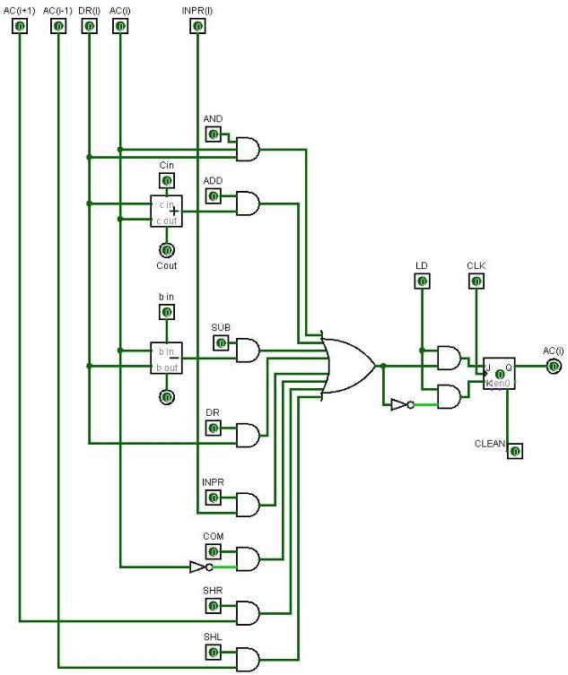

  **IMPLEMENTATION OF  I/O  SYSTEM**  

  A  computer  can  serve  no  useful  purpose  unless  it  communicates  with  the  external  environment.  Instructions  and  data  stored  in  memory  must  come  from  some  input  device.  Computational  results  must  be  transmitted  to  the  user  through  some  output  device.  

  **Input-Output  Configuration:-**  

  The  terminal  sends  and  receives  serial  information.  Each  quantity  of  information  has  eight  bits  of  an  alphanumeric  code.  The  serial  information  from  the  keyboard  is  shifted  into  the  input  register  INPR.  The  serial  information  for  the  printer  is  stored  in  the  output  register  OUTR.  These  two  registers  communicate  with  a  communication  interface  serially  and  with  the  AC  in  parallel.  The  input-output  configuration  is  below.  The  transmitter  interface  receives  serial  information  from  the  keyboard  and  transmits  it  to  INPR.  The  receiver  interface  receives  information  from  OUTR  and  sends  it  to  the  printer  serially.  

  The input register INPR consists of eight bits and holds an alphanumeric input information. The 1-bit input flag FGI is a control flip-flop. The flag bit is set to 1 when new information is available in the input device and is cleared to 0 when the insolation is accepted by the computer. The flag is needed to synchronize the timing rate difference between the input device and the computer . The process of information transfer is as follows. Initially, the input flag FGI is cleared to O. When a key is struck in the keyboard, an 8-bit alphanumeric code is shifted into INPR and the input flag FGI is set to 1. As long as the flag is set, the information in INPR cannot be changed by striking another key. The computer checks the flag bit; jf it is 1, the information from INPR is transferred in parallel into AC and FGI is cleared to o. ·Once the flag is cleared, new information can be shifted into INPR by striking another key. The output register OUTR works similarly but the direction of information flow is reversed. Initially, the output flag FGO is set to 1. The computer checks the flag bit; if it is 1, the information from AC is transferred in parallel to OUTR and FGO is cleared to O. The output device accepts the coded information, prints the corresponding character} and when the operation is completed, it sets FGO to 1. The computer does not load a new character into OUTR when FGO IS 0 because this condition indicates that the output device is in the process of printing the character.

  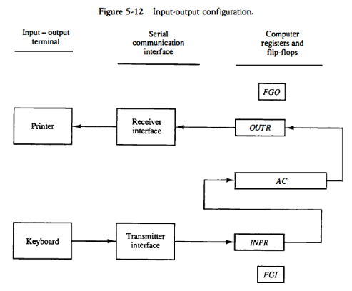**  

  **Input-Output  Instructions**  

  Input  and  output  instructions  are  needed  for  transferring  information  to  and  from  the  AC  register,  checking  the  flag  bits, a nd  for  controlling  the  interrupt  facility.  Input-output  instructions  have  an  operation  code  1111 and  are  recognized  by  the  control  when  D7  =  1  and  I  =  1.  The  remaining  bits  of  the  instruction  specifies  the  particular  operation.  The  control  functions  and  micro  operations  for  the  input-output  instructions.  These  instructions a re  executed  with  the  clock  transition  associated with  timing  signal  T,  Each  control  function  needs  a  Boolean  relation  D7IT3,  which  we  designate  for  convenience  by  the  symbol  p.  The  control  function  is  distinguished  by  one  of  the  bits  in  IR(6-1  1).  By  assigning  the  symbol  B,  to  the  bit  1  of  IR,  all  control  functions  can  be  denoted  by  pB;  for  i  =  6  though  11.     

  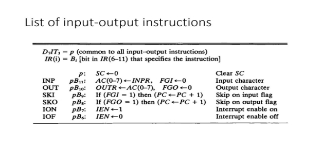  

  The  sequence  counter  SC  is  cleared  to  0  when  p  =  D71T3  =  I.  The  INP  instruction  transfers  the  input  information  from  lNPR  into  the  eight  low-order  bits  of  AC  and  also  clears  the  input  flag  to  0.  The  OUT  instruction transfers  the  eight l east  significant  bits  of  AC  into  the  output  register  OUTR  and  clears t he  output  flag  to  0.  The  next  two  instructions  check  the  status  of  the  flags  and  cause  a  skip  of  the next  instruction  if  the  flag  is  I.  The  instruction  that  is  skipped  will  normally  be  a  branch  instruction  to  return  and  check t he  flag  again.  The  branch  instruction  is  not  skipped  if the  flag  is  0.  If  the  flag  is  I,  the  branch  instruction  is  skipped  and  an  input  or  output  instruction  is  executed.  The  last t wo  instructions  set  and  clear  an  interrupt  enable  flip  flop  lEN.  The  purpose  of  lEN  is  explained i n  conjunction  with  the  interrupt  operation.  

  

  

  ### ` `SYSTEM  TESTING :
  **  

|**OPERATION**  |
**DIFFERENT**  

**TIME**  

**FRAME**  
|**MEMORY**  |**AR**  |**PC**  |**DR**  |**AC**   |**IR**   |**TR**  |**OU TR**  |` `<b>INPR</b>  |` `**SC**   |`  `**I**  |**S** |**E** |**R**  |**IEN**  |` `**FGI**   |` `**FGO**  |
| :- | :- | :- | :- | :- | :- | :- | :- | :- | :- | :- | - | :- | - | - | - | :- | :- | - |
|
**LDA(lo** 

**ad 5   in**  

**AC)**  
|**t 0** |**0**  |**0**  |**0**  |**0**  |**0**  |**0**  |**0** |**0**  |**0**  |**0**  |**0**  |**  |**  |**0**  |**0**  |**0**  |**0**  |
|**  |**t 0** |**0**  |**0**  |**0**  |**0**  |**0**  |**0**  |**0** |**0**  |**0**  |**0**  |**0**  |**0** |**0** |**0**  |**0**  |**0**  |**1**  |
|**  |**t 1**  |**200a**  |**0**  |**0**  |**0**  |**0**  |**0**  |**0** |**0**  |**0**  |**1**  |**0**  |**0** |**0** |**0**  |**0**  |**0**  |**1**  |
|**  |**t 2**  |**200a**  |**0**  |**1**  |**0**  |**0**  |**200a** |**0** |**0**  |**0**  |**2**  |**0**  |**0** |**0** |**0**  |**0**  |**0**  |**1**  |
|**  |t 3  |**005**  |**10** |**1**  |**0**  |**0**  |**200a** |**0** |**0**  |**0**  |**3**  |**0**  |**0** |**0** |**0**  |**0**  |**0**  |**1**  |
|**  |t 4  |**005**  |**10** |**1**  |**0**  |**0**  |**200a** |**0** |**0**  |**0**  |**4**  |**0**  |**0** |**0** |**0**  |**0**  |**0**  |**1**  |
|**  |t 5  |**005**  |**10** |**1**  |**5**  |**0**  |**200a** |**0** |**0**  |**0**  |**5**  |**0**  |**0** |**0** |**0**  |**0**  |**0**  |**1**  |
|**  |**t 6****   |**005**  |**10** |**1**  |**5**  |**5**  |**200a** |**0** |**0**  |**0**  |**6**  |**0**  |**0** |**0** |**0**  |**0**  |**0**  |**1**  |
|
**ADD(a** 

**dd  6  to**  

**content  of  AC)**  
|
  

**t 0**   
|**005**  |**10** |**1**  |**5**  |**5**  |**200a** |**0** |**0**  |**0**  |**0**  |**0**  |**0** |**0** |**0**  |**0**  |**0**  |**1**  |
|**  |<b>t 1</b>   |**100b** |` `**1**  |**1**  |**5**  |**5**  |**200a** |**0** |**0**  |**0**  |**1**  |**0**  |**0** |**0** |**0**  |**0**  |**0**  |**1**  |
|**  |<b>t 2</b>   |**100b** |` `**1**  |**2**  |**5**  |**5**  |**100b** |**0** |**0**  |**0**  |**2**  |**0**  |**0** |**0** |**0**  |**0**  |**0**  |**1**  |
|**  |<b>t 3</b>   |**006**  |**11** |**2**  |**5**  |**5**  |**100b** |**0** |**0**  |**0**  |**3**  |**0**  |**0** |**0** |**0**  |**0**  |**0**  |**1**  |
|**  |<b>t 4</b>   |**006**  |**11** |**2**  |**5**  |**5**  |**100b** |**0** |**0**  |**0**  |**4**  |**0**  |**0** |**0** |**0**  |**0**  |**0**  |**1**  |
|**  |<b>t 5</b>   |**006**  |**11** |**2**  |**6**  |**5**  |**100b** |**0** |**0**  |**0**  |**5**  |**0**  |**0** |**0** |**0**  |**0**  |**0**  |**1**  |
|**  |<b>t 6</b>   |**006**  |**11** |**2**  |**6**  |**11** |**100b** |**0** |**0**  |**0**  |**6**  |**0**  |**0** |**0** |**0**  |**0**  |**0**  |**1**  |

**

|**OPERATION**  |
**DIFFERENT**  

**TIME**  

**FRAME**  
|**MEMORY**  |**AR**  |**P C**  |**DR**  |**AC**   |**IR**   |**TR**  |**OUTR**  |` `**IN PR**  |**SC**   |`  `**I**  |**S** |**E** |**R**  |**IEN**  |` `**FGI**   |` `**FG O**   |
| :- | :- | :- | :- | :- | :- | :- | :- | :- | :- | :- | :- | :- | - | - | - | :- | :- | :- |
|**STA**  |**t 0**   |**006**  |**11**  |**2** |**6**  |**11** |**100b** |**0** |**0**  |**0** |**0**  |**0**  |**0** |**0** |**0**  |**0**  |**0**  |**1** |
|**  |**t 0**   |**006**  |**11**  |**2** |**6**  |**11** |**100b** |**0** |**0**  |**0** |**0**  |**0**  |**0** |**0** |**0**  |**0**  |**0**  |**1** |
|**  |**t 1**   |**300c**  |**2**  |**2** |**6**  |**11** |**100b** |**0** |**0**  |**0** |**1**  |**0**  |**0** |**0** |**0**  |**0**  |**0**  |**1** |
|**  |**t 2**   |**300c**  |**2**  |**3** |**6**  |**11** |**300c** |**0** |**0**  |**0** |**2**  |**0**  |**0** |**0** |**0**  |**0**  |**0**  |**1** |
|**  |**t 3****   |**000**  |**13**  |**3** |**6**  |**11** |**300c** |**0** |**0**  |**0** |**3**  |**0**  |**0** |**0** |**0**  |**0**  |**0**  |**1** |
|**  |**t 4****   |**000**  |**13**  |**3** |**6**  |**11** |**300c** |**0** |**0**  |**0** |**4**  |**0**  |**0** |**0** |**0**  |**0**  |**0**  |**1** |
|**  |**t 5****   |**11**  |**13**  |**3** |**6**  |**11** |**300c** |**0** |**0**  |**0** |**5**  |**0**  |**0** |**0** |**0**  |**0**  |**0**  |**1** |
|**OUT**  |
  

**t 0**   
|**11**  |**13**  |**3** |**6**  |**11** |**200a** |**0** |**0**  |**0** |**0**  |**0**  |**0** |**0** |**0**  |**0**  |**0**  |**1** |
|**  |<b>t 1</b>   |**f400**  |**3**  |**3** |**6**  |**11** |**200a** |**0** |**0**  |**0** |**1**  |**0**  |**0** |**0** |**0**  |**0**  |**0**  |**1** |
|**  |<b>t 2</b>   |**f400**  |**3**  |**4** |**6**  |**11** |**f400**  |**0** |**0**  |**0** |**2**  |**1**  |**0** |**0** |**0**  |**0**  |**0**  |**1** |
|**  |<b>t 3</b>   |**00**  |**400**  |**4** |**6**  |**11** |**f400**  |**0** |**0**  |**0** |**3**  |**1**  |**0** |**0** |**0**  |**0**  |**0**  |**1** |
|**  |<b>t 4</b>   |**00**  |**400**  |**4** |**6**  |**11** |**f400**  |**0** |**11**  |**0** |**4**  |**1**  |**0** |**0** |**0**  |**0**  |**0**  |**1** |

